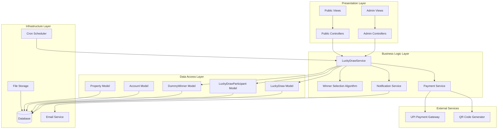
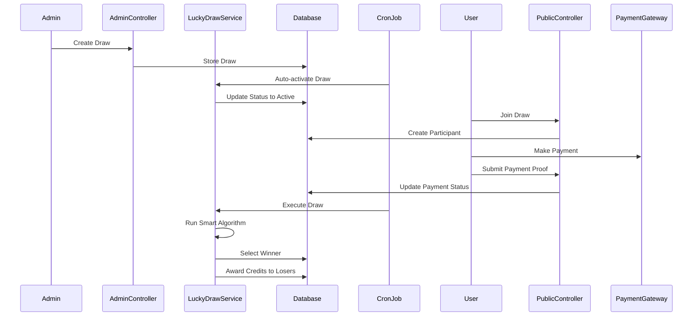
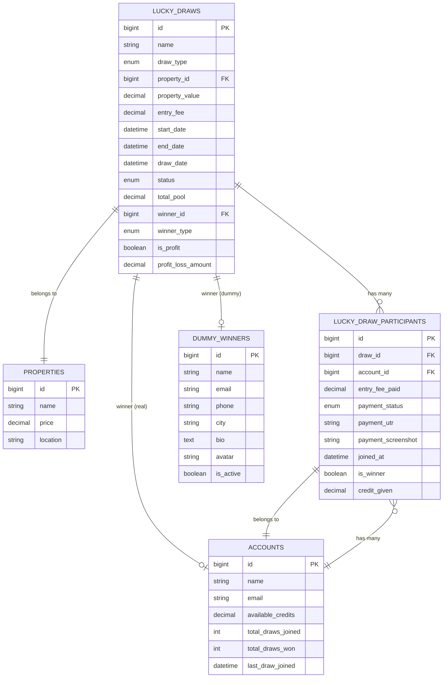

# Design Document

## Overview

The Lucky Draw Management System is a sophisticated Laravel-based feature that enables property-based lucky draws with intelligent profit/loss protection. The system consists of three main components: an administrative interface for draw management, a public interface for user participation, and an automated processing engine. The core innovation is the Smart Winner Selection Algorithm that dynamically chooses between real and dummy winners based on profitability calculations, ensuring business sustainability while providing genuine winning opportunities.

The system integrates seamlessly with existing Laravel real estate applications, extending the Account and Property models while introducing new entities for draws, participants, and dummy winners. The architecture follows Laravel best practices with dedicated controllers, services, models, and automated commands.

## Architecture

### System Architecture



### Component Interaction Flow



## Components and Interfaces

### Core Models

#### LuckyDraw Model
```php
class LuckyDraw extends Model
{
    // Properties
    protected $fillable = [
        'name', 'draw_type', 'property_id', 'property_value',
        'entry_fee', 'start_date', 'end_date', 'draw_date',
        'status', 'total_pool', 'winner_id', 'winner_type',
        'is_profit', 'profit_loss_amount', 'description', 'settings'
    ];
    
    // Relationships
    public function property(): BelongsTo;
    public function participants(): HasMany;
    public function paidParticipants(): HasMany;
    public function winner(): BelongsTo;
    public function dummyWinner(): BelongsTo;
    
    // Business Logic
    public function isActive(): bool;
    public function isCompleted(): bool;
    public function isProfitable(): bool;
    public function updateTotalPool(): void;
}
```

#### LuckyDrawParticipant Model
```php
class LuckyDrawParticipant extends Model
{
    // Properties
    protected $fillable = [
        'draw_id', 'account_id', 'entry_fee_paid',
        'payment_status', 'payment_utr', 'payment_screenshot',
        'joined_at', 'is_winner', 'credit_given'
    ];
    
    // Relationships
    public function draw(): BelongsTo;
    public function account(): BelongsTo;
    
    // Business Logic
    public function isPaid(): bool;
    public function isWinner(): bool;
    public function markAsWinner(): void;
    public function giveCredit(float $amount): void;
}
```

#### DummyWinner Model
```php
class DummyWinner extends Model
{
    // Properties
    protected $fillable = [
        'name', 'email', 'phone', 'city', 'bio', 'avatar', 'is_active'
    ];
    
    // Static Methods
    public static function getActive();
    public static function getRandomWinner();
    
    // Accessors
    public function getAvatarUrlAttribute(): string;
}
```

### Service Layer

#### LuckyDrawService
The central service class that orchestrates all draw-related operations:

```php
class LuckyDrawService
{
    // Core Operations
    public function executeDraw(LuckyDraw $draw): array;
    public function autoActivateDraws(): int;
    public function autoExecuteDraws(): int;
    
    // Winner Selection
    private function selectWinner(LuckyDraw $draw, $participants, float $totalPool): array;
    private function selectRealWinner($participants, bool $isProfit): array;
    private function selectDummyWinner(bool $isProfit): array;
    
    // Participant Processing
    private function processParticipants(LuckyDraw $draw, $participants, array $result): void;
    private function calculateCreditAmount(LuckyDrawParticipant $participant, LuckyDraw $draw, bool $isProfit): float;
    
    // Notifications
    private function sendNotifications(LuckyDraw $draw, array $result): void;
    private function sendWinnerNotification(LuckyDraw $draw, array $result): void;
    
    // Statistics
    public function getDrawStatistics(): array;
}
```

### Controller Layer

#### Admin Controllers
- **LuckyDrawController**: CRUD operations for draw management
- **Methods**: index, create, store, show, edit, update, destroy, activate, executeDraw

#### Public Controllers
- **PublicLuckyDrawController**: User-facing draw operations
- **Methods**: index, show, join, payment, submitPayment, userDashboard, winners

### Command Layer

#### ProcessLuckyDrawsCommand
Automated command for cron job execution:
```php
class ProcessLuckyDrawsCommand extends Command
{
    protected $signature = 'lucky-draws:process {--force}';
    
    public function handle();
    private function showStatistics();
}
```

## Data Models

### Database Schema

#### lucky_draws Table
```sql
CREATE TABLE lucky_draws (
    id BIGINT UNSIGNED AUTO_INCREMENT PRIMARY KEY,
    name VARCHAR(255) NOT NULL,
    draw_type ENUM('weekly','monthly') NOT NULL,
    property_id BIGINT UNSIGNED NOT NULL,
    property_value DECIMAL(15,2) NOT NULL,
    entry_fee DECIMAL(10,2) NOT NULL,
    start_date DATETIME NOT NULL,
    end_date DATETIME NOT NULL,
    draw_date DATETIME NOT NULL,
    status ENUM('upcoming','active','completed','cancelled') DEFAULT 'upcoming',
    total_pool DECIMAL(15,2) DEFAULT 0.00,
    winner_id BIGINT UNSIGNED NULL,
    winner_type ENUM('real','dummy') NULL,
    is_profit BOOLEAN DEFAULT FALSE,
    profit_loss_amount DECIMAL(15,2) DEFAULT 0.00,
    description TEXT NULL,
    settings JSON NULL,
    created_at TIMESTAMP NULL,
    updated_at TIMESTAMP NULL
);
```

#### lucky_draw_participants Table
```sql
CREATE TABLE lucky_draw_participants (
    id BIGINT UNSIGNED AUTO_INCREMENT PRIMARY KEY,
    draw_id BIGINT UNSIGNED NOT NULL,
    account_id BIGINT UNSIGNED NOT NULL,
    entry_fee_paid DECIMAL(10,2) NOT NULL,
    payment_status ENUM('pending','paid','refunded') DEFAULT 'pending',
    payment_utr VARCHAR(255) NULL,
    payment_screenshot VARCHAR(255) NULL,
    joined_at DATETIME NOT NULL,
    is_winner BOOLEAN DEFAULT FALSE,
    credit_given DECIMAL(10,2) DEFAULT 0.00,
    created_at TIMESTAMP NULL,
    updated_at TIMESTAMP NULL,
    UNIQUE KEY unique_draw_account (draw_id, account_id)
);
```

#### dummy_winners Table
```sql
CREATE TABLE dummy_winners (
    id BIGINT UNSIGNED AUTO_INCREMENT PRIMARY KEY,
    name VARCHAR(255) NOT NULL,
    email VARCHAR(255) NOT NULL,
    phone VARCHAR(20) NOT NULL,
    city VARCHAR(100) NULL,
    bio TEXT NULL,
    avatar VARCHAR(255) NULL,
    is_active BOOLEAN DEFAULT TRUE,
    created_at TIMESTAMP NULL,
    updated_at TIMESTAMP NULL
);
```

#### Account Model Extensions
```sql
ALTER TABLE re_accounts ADD COLUMN (
    available_credits DECIMAL(10,2) DEFAULT 0.00,
    total_draws_joined INT DEFAULT 0,
    total_draws_won INT DEFAULT 0,
    last_draw_joined DATETIME NULL
);
```

### Data Relationships



Now I need to use the prework tool to analyze the acceptance criteria before writing the correctness properties section.

<function_calls>
<invoke name="prework">
<parameter name="featureName">lucky-draw-management-system